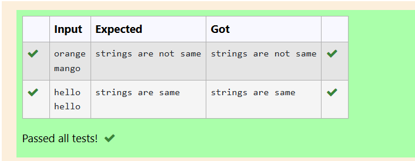
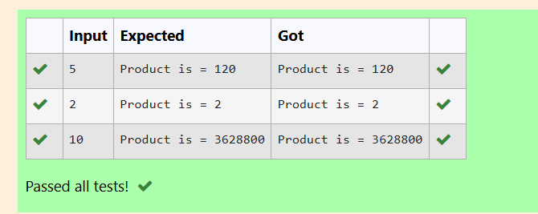
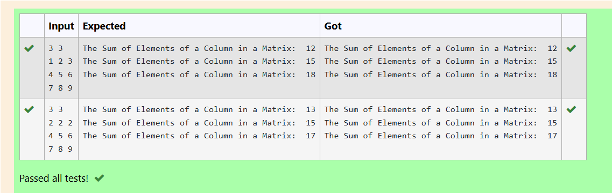
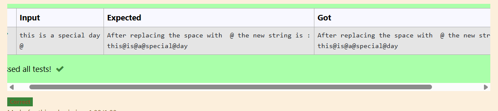
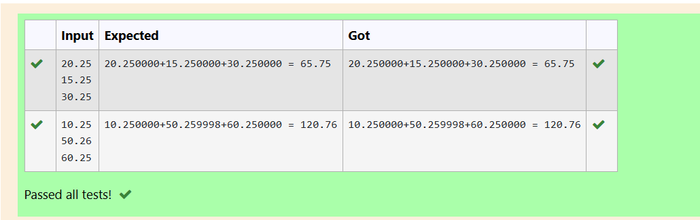

EX-21-POINTERS
# AIM:
Write a C program to convert a 23.65 into 25 using pointer

## ALGORITHM:
1.	Declare a double variable to hold the floating-point number (23.65).
2.	Declare a pointer to double to point to the address of the variable.
3.	Use the pointer to modify the value to 25.0.
4.	Print the modified value.

## PROGRAM:
```
#include<stdio.h>
int main(){
    float num;
    float *ptr;
    int intnum;
    scanf("%f",&num);
    ptr = &num;
    intnum=(int)(*ptr);
    printf("the integer equivalent of %.2f =%d\n",*ptr,intnum);
    return 0;
}

```
## OUTPUT:
 	



## RESULT:
Thus the program to convert a 23.65 into 25 using pointer has been executed successfully.
 
 


# EX-22-FUNCTIONS AND STORAGE CLASS

## AIM:

Write a C program to calculate the Product of first 12 natural numbers using Recursion

## ALGORITHM:

1.	Define a recursive function calculateProduct that takes an integer parameter n.
2.	Return n multiplied by the result of the calculateProduct function called with n - 1.
3.	Declare an integer variable n and an unsigned long long variable product.
4.	Initialize n with the value 12 (for the first 12 natural numbers).
5.	Call the calculateProduct function with n and store the result in the product variable.
6.	Print the result, indicating it is the product of the first 12 natural numbers.

## PROGRAM:
```
#include <stdio.h>
int product(int n)
{
    if (n == 1)
        return 1;
    else
        return n * product(n - 1);
}
int main()
{
    int n;
    scanf("%d", &n);

    if (n <= 0)
        printf("Please enter a natural number.\n");
    else
        printf("Product is = %d\n", product(n));
    return 0;
}

```
## OUTPUT:



## RESULT:

Thus the program has been executed successfully.
 
 


# EX-23-ARRAYS AND ITS OPERATIONS

## AIM:

Write C Program to find Sum of each row of a Matrix

## ALGORITHM:

1.	Declare and initialize the matrix with the desired values.
2.	Create a loop to iterate through each row of the matrix.
3.	Inside the loop, calculate the sum of the elements in each row.
4.	Print the sum for each row.

## PROGRAM:

```
#include <stdio.h>
int main()
{
    int matrix[10][10];
    int i, j, r, c, sum;
    scanf("%d %d", &r, &c);
    for(i = 0; i < r; i++)
    {
        for(j = 0; j < c; j++)
        {
            scanf("%d", &matrix[i][j]);
        }
    }
    
    for(j = 0; j < c; j++)
    {
        sum = 0;
        for(i = 0; i < r; i++)
        {
            sum += matrix[i][j];
        }
        printf("The Sum of Elements of a Column in a Matrix:  %d\n",sum);
    }

    return 0;
}
```

## OUTPUT


 
 

 ## RESULT
 


# EX-24-STRINGS

## AIM:

Write C program for the below pyramid string pattern. Enter a string: PROGRAM Enter number of rows: 5 P R O G R A M P R O G R A M P R O G R A M

## ALGORITHM:

1.	Input the number of rows for the pyramid (e.g., num_rows).
2.	Initialize variables:i for the row count (starting from 1),j for the character count (starting from 1)
3.	Start a loop for i from 1 to num_rows (for each row of the pyramid).
4.	Calculate the midpoint position as midpoint = (2 * num_rows - 1) / 2.
5.	End the program.

## PROGRAM:
```
#include <stdio.h>
#include <string.h>
int main()
{
    char str[200], ch;
    int i;
    fgets(str, sizeof(str), stdin);
    str[strcspn(str, "\n")] = '\0'; 
    scanf("%c", &ch);
    for (i = 0; i < strlen(str); i++)
    {
        if (str[i] == ' ')
            str[i] = ch;
    }
    printf("After replacing the space with  %c the new string is :\n", ch);
    printf("%s\n", str);
    return 0;
}
```

## OUTPUT



 

## RESULT

Thus the C program to String process executed successfully
 

 
.


# EX -25 –DISPLAYING ARRAYS USING POINTERS
## AIM

Write a c program to read and display an array of any 6 integer elements using pointer

## ALGORITHM
Step 1: Start the program.
Step 2: Declare the following:
•	Integer variable i for iteration.
•	Integer variable n to store the number of elements.
•	Integer array arr[10] to hold up to 10 elements.
•	Integer pointer parr and initialize it to point to the array arr.
Step 3: Read the value of n (number of elements) from the user.
Step 4: Loop from i = 0 to i < n:
•	Read an integer value and store it in the address parr + i using pointer arithmetic.
Step 5: Loop from i = 0 to i < n:
•	Print the element at *(parr + i) using pointer dereferencing.
Step 6: End the program.

## PROGRAM
```
#include<stdio.h>
int main(){
    float a,b,c,sum;
    float *ptr1,*ptr2,*ptr3;
    scanf("%f %f %f",&a,&b,&c);
    ptr1=&a;
    ptr2=&b;
    ptr3=&c;
    sum=*ptr1+*ptr2+*ptr3;
    printf("%.6f+%.6f+%.6f = %.2f\n",*ptr1,*ptr2,*ptr3,sum);
    return 0;
}
```
## OUTPUT

 

## RESULT

Thus the C program to read and display an array of any 6 integer elements using pointer has been executed


